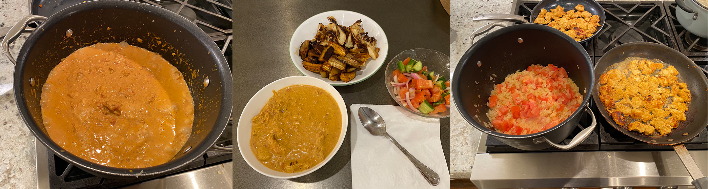

# Nader's Chicken Tikka Masala recipe

This is one of my favorite dishes, and a lot of people who eat this tell me it's one of their favorite meals as well. They often ask for the recipe, so I decided to open source it. This will probably evolve over time as I improve and experiment with it. Enjoy!

## Ingredients ℹ️

### Chicken marinade 🐔

- 2 lbs boneless and skinless chicken thighs or breasts (thighs don't marinate as well)
- 1/4 cup plain yogurt
- 1 1/2 tablespoons minced garlic
- 1 tablespoon minced fresh ginger
- 3.5 teaspoons chicken tikka masala seasoning ([MDH](https://mdhspices.com/product/mdh-chicken-masala/), [Shan](https://www.shanfoods.com/product/recipe-mixes/curry/chicken-masala/), or [Rasoi Magic](https://www.rasoimagic.com/products) brand) 
- 1/2 teaspoon Kashmiri chili powder
- 1 teaspoon of salt
- 3 tablespoons butter/ghee/neutral oil for sauteing / cooking the chicken
- optional: paprika, smoked or otherwise, to add color and a subtle flavor.

### Sauce 🍲

- 5-8 tablespoons butter\ghee\neutral oil
- 2 medium red onions, diced
- 5 tablespoons garlic finely grated
- 5 tablespoons ginger finely grated
- 2-3 tablespoons chicken masala seasoning (MDH or shan brand)
- 28oz can stewed tomatoes
- 3-4 tablespoons tomato paste
- 1/2 teaspoon Kashmiri chili powder
- 1 teaspoon salt
- 1/4 to 1/2 pint of heavy cream or half & half
- 3 teaspoons brown sugar
- 2 to 3 heaping pinches of dried methi leaves

## Instructions ℹ️

### The chicken (Chicken Tikka) 🐔

- Put the chicken in a bowl with all of the ingredients of the chicken marinade, stir everything together well and let it sit for anywhere from 30 minutes to a 24 hours.

- When ready to cook: pre-heat a cast iron skillet in the oven under the broiler, and cook the chicken thighs under the broiler once the pan is hot. ~15-20 minutes.
* alternatively, just put on a baking sheet under the broiler and flip the chicken over to get color on both sides.

### The gravy (Masala) 🥣

- In a large and tall cooking pot, melt the butter\heat up the oil and fry the onions until they develop some color while stirring occasionally.

- Add ginger, garlic, and tomato paste and let cook for just about 30 seconds while continuing to stir. 

- Add chicken tikka masala seasoning, kashmiri chili powder, salt, tomatoes with the liquid, brown sugar and methi leaves. Let this simmer for a bit - 20-30 minutes.

- Add ingredients from the pot into a blender, blending until everything is pretty well incorporated.

- add the gravy back to the pot, and let simmer a bit longer if you so choose (30-90 minutes).

- Add the heavy cream or half & half, stirring everything in.

- Finally, add the chicken and let it simmer for 5 - 10 minutes. From here, check the consistency and decide to your taste to add more cream.

Serve with rice, naan, or roti. 🚀
